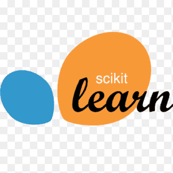

<h1 align="center">
  
</h1>

<h5 align="center">
  <code><a href="[https://www.linkedin.com/in/osmandurdag](https://www.linkedin.com/in/gyanbardhan-68794b250/)/" title="LinkedIn Profile"> LinkedIn</a></code>
  <code><a href="https://leetcode.com/u/gyan_10022003/" title="Leetcode Profile"> Leetcode</a></code>
  <code><a href="https://www.codechef.com/users/gyan_15102002" title="Codechef">Codechef</a></code>
  <code><a href="https://www.instagram.com/gyanbardhan123/" title="Instagram Profile"> Instagram</a></code>
</h5>
 

  Hi, I'm Gyanbardhan, Data Scientist
   
   
  🎓 I am currently pursuing a Bachelor of Technology in Computer Science and Engineering at the Indian Institute of Information Technology, Nagpur.
   
  🎓 I completed my 12th grade from Chauhan Public School, Bhagalpur, and my 10th grade from St. Paul's School, Bhagalpur
   
  💻 I have a passion for coding in machine learning, exploring data science, and advancing in generative AI technologies. I also enjoy reading books related to these fields.
   
  📚 I’m currently learning how fine tune a LLM Model.
   
  💬 Ask me anything about from <a href="https://github.com/Gyanbardhan/Gyanbardhan/issues" title="Issues">Here</a>
   
  📫 How to reach me: <a href="mailto: bt21cse194@iiitn.ac.in">bt21cse194@iiitn.ac.in</a>

<h2 align="center">🔥 Languages & Frameworks & Tools & Abilities 🔥</h2>
 

  <code></code>
  <code></code>
  <code></code>
  <code></code>
  <code></code>
  <code></code>
  <code></code>
  <code></code>
  <code></code>
  <code></code>
  <code></code>
  <code></code>
  <code></code>
  <code></code>
  <code></code>
  <code></code>
  <code></code>
  <code></code>
  <code></code>
  <code></code>
  <code></code>
  <code></code>
  <code></code>
  <code></code>

<h2 align="center">⚡ Stats ⚡</h2>
 

  

    
    </a>
    
    </a>
  

           
  

    
    </a>
  

   

  

<h2 align="center">👨‍💻 Repositories 👨‍💻</h2>
 

  

      

  
  

      

  
  

      

<h4 align="center">
  <a href="https://github.com/Gyanbardhan?tab=repositories" title="Show Repositories">🔎 Show More 🔍</a>
</h4>
